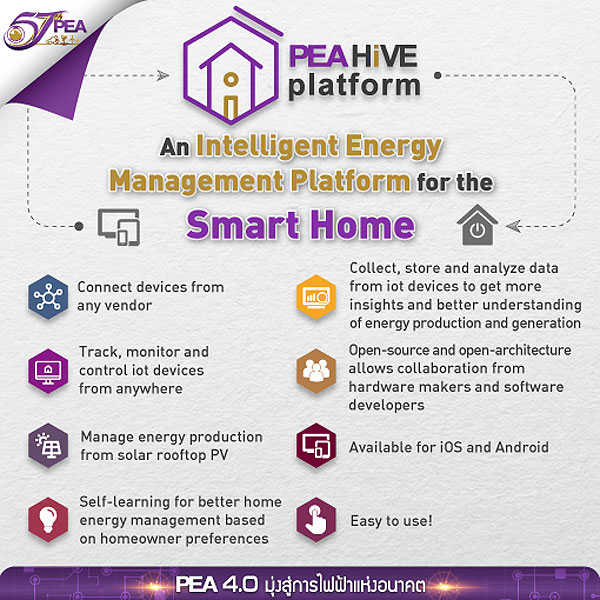

.. _get-started-overview:

Overview
========

PEA HiVE is the open developer platform for the Internet of Things.

With PEA HiVE, developers can:

- Create applications that let users connect devices, actions, and external services to create automations.
- Integrate new devices into the PEA HiVE ecosystem.
- Publish applications and device integrations to the PEA HiVE catalog.

As Thailand 4.0 progresses unstoppably, PEA is now developing the “PEA HiVE” smart home platform

Under Thailand's Alternative Energy Development Plan (AEDP) 2015, power generation from solar energy is targeted at 6,000 MW in 2036. Of this residential rooftop solar PVs will account for a significant portion.

The 100 MW rooftop solar PV self-consumption pilot scheme announced in 2016 aims to encourage development of solar energy in the residential sector. In coming years as costs steadily decrease making them more affordable, it is expected that more homes and buildings will have rooftop solar PV installations.

Meanwhile, on the consumer side, there’s a big push from device manufacturers to develop Internet of Things (IoT) technologies which are becoming integral to being more competitive in the home appliances market in the digital 4.0 era.

One of the biggest air conditioner makers and distributors in Thailand is developing and testing an adapter that converts ordinary wall-mounted air conditioners into IoT-enabled devices. This allows their customers to turn their air conditioners on or off and change the room temperature setpoint from anywhere, even outside the house.

Other vendors provide IoT devices for the home, ranging small sensors, smart plugs and light bulbs to large appliances such as TVs, refrigerators, air conditioners, and even complete solar rooftop PV and energy storage installations.

As these technologies develop and become more affordable, electricity for homes will increasingly  come from a combination of the power grid and local renewable energy resources such as solar rooftop PVs, and be equipped with various types of IoT devices.

Without tools to monitor energy generation from solar PV and monitor energy consumption of appliances and the ability to control/schedule appliances, the benefits of having rooftop solar PV and IoT devices will remain untapped.

Homeowners would need to install one mobile app per IoT device which is extremely cumbersome when there are several devices in the home. Taking into account home energy efficiency, homeowners might not be at home or be able to schedule use of appliances when solar-generated energy is available. Moreover, human interactions trying to optimize energy usage from solar in conjunction with energy consumption do not capture devices and environment interactions leading to inefficient use of energy.

PEA HiVE is an IoT platform specifically for managing energy usage and bridging all IoT devices to work together. The main objectives are to agnostically orchestrate devices from various manufacturers where different communication technologies and protocols are used (e.g. Modbus solar inverter and cloud-connected air conditioners).

PEA HiVE software comes with applications that help homeowners understand and automatically manage their energy consumption in accordance with available energy from solar rooftop generation, with the ultimate goal to achieve net-zero energy homes.

Homeowners are able to track their electricity charges, energy consumption, solar PV generation, and sensor condition, as as well as appliances, all in real-time.

They can choose applications in the PEA’s marketplace, including “home comfort management” to automatically fine tune the temperature setpoint of air conditioners and dimmable lamps, thereby helping to save energy and minimize electricity bills.

In summary, PEA HiVE Platforms are able to:

*  connect to smart devices agnostically from various manufacturers
*  monitor and control smart devices from anywhere
*  manage solar PV rooftop with energy storage
*  add more devices later after first installation (‘Pay As You Grow’)
*  self-learn and adapt according to homeowner preferences
*  digest and analyze home data from IoT devices for energy production and usage summary
*  operate with both iOS and Android operating systems
*  develop solutions for IoT devices and applications for the home (e.g. home security, comfort/convenient, healthcare, or energy applications)

With the introduction of Internet of Things, connected sensors and smart devices are getting cheaper and becoming more widely available.
PEA HiVE is an open-source, open-architecture IoT platform that works with devices from various vendors and hardware makers.
PEA HiVE is engineered to work with different communication technologies, including Ethernet (IEEE 802.3), Serial (RS-485), ZigBee (IEEE 802.15.4), and Wi-Fi (IEEE 802.11), and different communication protocols, including MQTT, BACnet, Modbus, Web, ZigBee API, OpenADR, and OCPP.

For more information please contact peahive@gmail.com or visit PEA HiVE Platform Facebook Fan Page at https://www.facebook.com/peahiveplatform

Source : Warodom Khamphanchai, Ph.D.
Substation and Transmission System Research Section
Research Division
Reseach and Development Department
Provincial Electricity Authority (PEA)
www.pea.co.th

----

Developer highlights
--------------------

PEA HiVE was built to be developer-friendly. Some of the key developer features:

- A simple programming framework using the Groovy programming language. Don't know Groovy? No worries. We've written a :ref:`tutorial <groovy-basics>` to get you up to speed.
- An architecture that allows developers to control hardware with simple software. Turning a switch on is as easy as ``switch.on()``.
- A web-based IDE for developing PEA HiVE solutions.
- A Simulator for testing your code, *even if you don't have specific devices you are developing for*.
- An active and growing `community <https://community.PEA HiVE.com/>`__ of PEA HiVE developers.

----

How it works
------------

There are two primary ways that developers can create with PEA HiVE.

SmartApps
^^^^^^^^^

.. code-block:: groovy

    def someoneArrived(evt) {
        lights.on()
        sendPush("Someone has arrived!")
    }

*SmartApps* are small programs that allow users to connect their devices to make their home more intelligent. As the world around us becomes more and more connected, it is the intelligence *between* these devices that makes our world smart. SmartApps allow developers to control hardware with simple software.

SmartApps can typically be summarized by what they do. Some example SmartApps:

- *"Turn the lights off after a certain time when no motion is detected"*
- *"Notify me if a door opens when I'm not home"*
- *"Turn my thermostat down when I leave home"*

PEA HiVE ships with many SmartApps already available. Almost all automations that you configure with your PEA HiVE mobile application are SmartApps. If you've set up your lights to come on when motion is detected, or to receive a notification if your door opens when you aren't home, you've used SmartApps.

Of course, SmartApps are capable of much more than the above examples. SmartApps can communicate with external web services, send push and SMS notifications, expose their own REST endpoints, and more.

Device Handlers
^^^^^^^^^^^^^^^

.. code-block:: groovy

    def on() {
    	zigbee.on()
    }

Developers can also integrate new devices into the PEA HiVE ecosystem by creating *Device Handlers*. These Groovy programs encapsulate the details of communication between PEA HiVE and the physical devices. In the SmartApp code example above, we turned the lights on by simply calling ``lights.on()``. The Device Handler is responsible for physically turning the light on (don't worry about the details of this just yet).

----

An open platform
----------------

PEA HiVE was built by developers, for developers. We recognized that only by creating an open development platform, will the power of the IoT be fully unleashed.

Our :ref:`web-based IDE and simulator <tools_ide>` allows developers to create, edit, test, and publish their PEA HiVE code. SmartApps and Device Handlers are hosted in our `public GitHub Repository <https://github.com/PEA HiVECommunity/PEA HiVEPublic>`__, and our web-based IDE and Simulator is :ref:`integrated with GitHub <github_integration>`.

Our vibrant `developer community <https://community.PEA HiVE.com/c/developers>`__ is a great place to learn, collaborate, and help each other.

----

What's next
-----------

To start developing with PEA HiVE, you will need to create a developer account and become familiar with the developer tools. This is covered next in the :ref:`quick-start`.

PEA HiVE uses the Groovy programming language. Don't know Groovy? Check out our :ref:`groovy-basics` and :ref:`groovy-for-PEA HiVE` tutorials.

Then, take a deep dive into developing with PEA HiVE by writing your first SmartApp, using the :ref:`first-smartapp-tutorial`.
