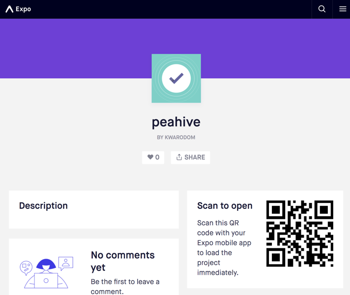

.. _pea-hive-features:

PEA HiVE Features
====================

----

สรุปภาพรวมความสามารถของ PEA HiVE Platform

=========================================  ================  ===================
PEA HiVE Features                          Web Application   Mobile Application
=========================================  ================  ===================
A. General Features
--------------------------------------------------------------------------------
| 1. เกตเวย์เดียวสำหรับทุกอุปกรณ์ภายในบ้าน         X                 X
B. Device/Appliances Integration
--------------------------------------------------------------------------------
| 2. AC Daikin                                                X
| 3. AC Saijo                               X                 X
| 4. TV                                     X                 X
| 5. Amazon Echo                            X                 X
| 6. Sonos                                  X                 X
| 7. Samsung Camera                                           X
| 8. Philip Hue                             X                 X
| 9. Relay lighting (Kitchen)               X                 X
| 10. Relay lighting (Living room)          X                 X
| 11. Wemo Insight Switch                   X                 X
| 12. Smappee power parameter               X                 X
| 13. Creative power                                          X
| 14. Yale                                                    X
| 15. Sompy curtain                                           X
| 16. Fibaro multi sensor                                     X
| 17. Netatmo weather station                                 X
| 18. Dell 3030 Gateway                                       X
| 19. TPlink smart plug                     X                 X
C. Renewable Energy Integration
--------------------------------------------------------------------------------
| 20. แสดงผลและควบคุม Growatt Inverter                         X
| 21. แสดงผลและควบคุม Must Inverter          X                 X
D. Smart Modes
--------------------------------------------------------------------------------
| 22. Good Morning                                            X
| 23. Good Night                                              X
| 24. Good Bye                                                X
| 25. I'm Back                                                X
| 26. Eco Mode                              X                 X
| 27. Demand Response Mode (OpenADR)        X
E. Open Platform, Open Architecture
--------------------------------------------------------------------------------
| 28. PEA HiVE Developer Documentation (อยู่ระหว่างดำเนินการ)
================================================================================

----

PEA HiVE Web Application
--------------------------
ความสามารถของระบบ PEA HiVE Web Application สามารถสรุปได้ดังต่อไปนี้คือ

.. image:: ../img/pea-hive-features/pea-hive-web-application3.png

1.  ติดตามปริมาณการใช้พลังงานไฟฟ้ารวมไปถึงการผลิตไฟฟ้าของระบบ rooftop solar PV ได้บน web และ mobile application

    .. image:: ../img/pea-hive-features/pea-hive-web-application4.png

    |

#.  เปรียบเทียบพลังงานไฟฟ้าที่ผลิตได้จากโซลาร์รูฟท็อบ กับการใช้ไฟฟ้าจากการไฟฟ้า และผลรวมของการใช้พลังงานไฟฟ้าภายในบ้าน ได้แบบ real-time

    .. image:: ../img/pea-hive-features/pea-hive-web-application5.png

    |

#.  แยกแยะการใช้ไฟฟ้าของอุปกรณ์ต่างๆออกจากกัน แสดงผลการใช้พลังงานและประมาณการค่าไฟฟ้าของแต่ละเครื่องใช้ไฟฟ้าภายในบ้าน
    ด้วยการวัดการใช้ไฟฟ้าเพียงจุดเดียวที่สาย line ของวงจรโหลดของบ้านโดยใช้หลักการของ Non-Intrusive Load Monitoring (NILM)

    .. image:: ../img/pea-hive-features/pea-hive-web-application6.png
    .. image:: ../img/pea-hive-features/pea-hive-web-application7.png
    .. image:: ../img/pea-hive-features/pea-hive-web-application8.png

    |

#.  สามารถดูอัตราค่าไฟฟ้าแบบ TOU หรือ Flat-rate ได้

    .. image:: ../img/pea-hive-features/pea-hive-web-application9.png

    |

#.  สามารถดูประมาณการค่าไฟฟ้าในแต่ละวันและรายเดือนแบบ real-time ได้

    .. image:: ../img/pea-hive-features/pea-hive-web-application10.png

    |

#.  สามารถเชคจำนวนของคนที่อยู่ภายในบ้านได้ ผ่านกล้องวงจรปิดภายในบ้าน โดนใช้ human detection algorithm

    .. image:: ../img/pea-hive-features/pea-hive-web-application11.png

    |

#.  สามารถดูค่าไฟฟ้าจำแนกรายชนิดของอุปกรณ์ต่างเช่น ระบบแสงสว่าง ระบบปรับอากาศ วงจรเต้าเสียบ และอุปกรณ์ชารจ์รถยนต์ไฟฟ้าได้

    .. image:: ../img/pea-hive-features/pea-hive-web-application12.png

    |

#.  ตรวจสอบสถานะเปิดปิดของอุปกรณ์ต่างๆ เช่นหลอดไฟ แอร์ และเต้าเสียบไฟฟ้า

    .. image:: ../img/pea-hive-features/pea-hive-web-application13.png

    |

#.  มี notification แจ้งความผิดปรกติของการใช้พลังงานไฟฟ้า อุปกรณ์ต่างๆ รวมไปถึงความผิดพลาดของการทำงานของระบบ

    .. image:: ../img/pea-hive-features/pea-hive-web-application14.png

    |

#.  เลือกโหมดการทำงานรวมของบ้านให้เหมาะสมกับความต้องการของผู้อยู่อาศัยได้ ยกตัวอย่างเช่น home comfort management application
    สามารถเลือกโหมด comfort เพื่อความสะดวกสบาย หรือโหมด eco สำหรับการประหยัดพลังงานอย่างสูงสุดได้

    .. image:: ../img/pea-hive-features/pea-hive-web-application15.png

    |

#.  มีระบบรายงานสภาพอากาศภายนอกและภายในบ้าน

    .. image:: ../img/pea-hive-features/pea-hive-web-application16.png
    .. image:: ../img/pea-hive-features/pea-hive-web-application17.png

    |

#.  มีระบบการจัดการเพื่อให้ผลรวมการใช้พลังงานของบ้านเป็นศูนย์ด้วยการ monitor และ control อุปกรณ์ IoT ภายในบ้านพักอาศัย โดยใช้ machine learning algorithm

    .. image:: ../img/pea-hive-features/pea-hive-web-application18.png
    .. image:: ../img/pea-hive-features/pea-hive-web-application19.png

    |

#.  ควบคุมอุปกรณ์และเครื่องใช้ไฟฟ้าต่างๆ พร้อมตรวจสอบสถานะได้แบบ real-time

    .. image:: ../img/pea-hive-features/pea-hive-web-application20.png

    |

#.  สามารถตรวจสอบสถานะและเปลี่ยนแปลงโหมดของ solar inverter ผ่านโพรโตคอล Modbus TCP
    พร้อมทั้งแสดงกราฟความสัมพันธ์ของการใช้พลังงานจากโซลาร์ กริด และโหลด

    .. image:: ../img/pea-hive-features/pea-hive-web-application21.png
    .. image:: ../img/pea-hive-features/pea-hive-web-application22.png

    |

#.  สามารถควบคุมอุปกรณ์รายตัวได้เช่น smart airconditioner, smart lighting, smart plug พร้อมทั้งแสดงข้อมูลการใช้พลังงานและข้อมูลทั่วไปของอุปกรณ์รายตัว

    .. image:: ../img/pea-hive-features/pea-hive-web-application23.png
    .. image:: ../img/pea-hive-features/pea-hive-web-application24.png
    .. image:: ../img/pea-hive-features/pea-hive-web-application25.png
    .. image:: ../img/pea-hive-features/pea-hive-web-application26.png

    |

#.  สามารถใช้อุปกรณ์ smart home จากผู้ผลิตหลากหลายยี่ห้อ พร้อมทั้งเพิ่มและลดอุปกรณ์ smart home ได้

    .. image:: ../img/pea-hive-features/pea-hive-web-application27.png
    .. image:: ../img/pea-hive-features/pea-hive-web-application28.png

    |

#.  สามารถดูสถิติและเปรียบเทียบการใช้พลังงานจากการไฟฟ้า (Grid) เทียบกับใช้พลังงานที่ผลิตได้จากโซลาร์รูฟท็อบ (Solar) รายวัน รายสัปดาห์ และรายเดือน ได้

    .. image:: ../img/pea-hive-features/pea-hive-web-application29.png
    .. image:: ../img/pea-hive-features/pea-hive-web-application30.png
    .. image:: ../img/pea-hive-features/pea-hive-web-application31.png

    |

#.  สามารถพัฒนาให้รองรับ OpenADR protocol ที่สามารถทำงานร่วมกับ Virtual Top Node ของระบบ Demand Response ได้

    |

#.  มีระบบวิเคราะห์ข้อมูลจาก solar inverter, smart meter, และอุปกรณ์ต่างๆ โดยใช้เทคนิคทางด้าน Data Analytics, Machine Learning,
    และ Artificial Intelligence เพื่อการวิเคราะห์ในด้านการจัดการพลังงาน เช่นการออกรายงานและติดตามการใช้พลังงานโดยการทำ longitudinal benchmaking
    และ cross-sectional benchmarking รวมไปถึงทำตรวจจับความผิดปรกติของระบบและอุปกรณ์ต่างๆ (Anomaly Detection)

    .. image:: ../img/pea-hive-features/pea-hive-web-application32.png
    .. image:: ../img/pea-hive-features/pea-hive-web-application33.png

    |

#.  สามารถสื่อสารและสั่งงานบ้านสมาร์ท กฟภ. ด้วยเสียงได้

    |

----

PEA HiVE Mobile Application
-----------------------------
ภาพรวมของ PEA HiVE Mobile Application

|

สำหรับ Mobile Application Tester สามารถทดสอบ โดยใช้ Expo App แสกน QR code ข้างล่างนี้แล้วทดสอบด้วย login ที่ได้ลงทะเบียนไว้ได้

ความสามารถของระบบ PEA HiVE Mobile Application สามารถสรุปได้ดังต่อไปนี้คือ

1.  เจ้าของบ้านสามารถลงทะเบียนผู้ใช้งานใหม่ (signup) และสามารถ login เข้าไปใช้งาน PEA HiVE ในแต่ละบ้านที่ได้ลงทะเบียนไว้
    ซึ่งในขณะนี้หนึ่งบ้านสามารถลงทะเบียนผู้ใช้งานได้มากกว่า 1 account (multi-user enabled)

    .. image:: ../img/pea-hive-features/pea-hive-mobile-application3.png
    .. image:: ../img/pea-hive-features/pea-hive-mobile-application4.png
    .. image:: ../img/pea-hive-features/pea-hive-mobile-application5.png

    |

#.  หน้า Home ดูสถานะโดยรวมของบ้านเช่นตำแหน่งที่ตั้ง (location) สภาพอากาศปัจจุบัน (current weather)
    สถานะต่างๆโดยรวมของห้องต่างๆภายในบ้าน (room conditions) และโหมดการทำงานของบ้านในปัจจุบัน (current home mode)
    และยังสามารถเปลี่ยนการตั้งค่าต่างๆของบ้านได้เช่น รูปเจ้าของบ้าน รูปของบ้าน สถานที่ตั้ง เปลี่ยน password และการตั้งค่าต่างๆ

    .. image:: ../img/pea-hive-features/pea-hive-mobile-application6.png
    .. image:: ../img/pea-hive-features/pea-hive-mobile-application7.png
    .. image:: ../img/pea-hive-features/pea-hive-mobile-application8.png

    |

#.  มีระบบแจ้งเตือน (mobile push notification) เมื่อมีเหตุการณ์ที่ไม่ปรกติเกิดขึ้นภายในบ้าน เช่น
    มีผู้บุกรุกเมื่อไม่อยู่บ้าน ตรวจจับควันได้จาก smoke detector หรือเมื่อมีนำ้รั่วผ่าน water leak sensor

    .. image:: ../img/pea-hive-features/pea-hive-mobile-application9.png

    |

#.  เปลี่ยนโหมดการทำงานของบ้านผ่าน Scene ต่างๆ เช่น Good Morning, Good Night, Good Bye, I'm Back, และ Eco Mode
    โดยในแต่ละโหมดผู้ใช้งานสามารถเลือกและตั้งค่าอุปกรณ์ให้ทำงานตามที่ต้องการได้เช่น Eco Mode ให้แอร์ภายในบ้านปรับอุณหภูมิให้สูงขึ้น
    และให้หลอดไฟ dim ลงให้เหมาะสมตามค่าความส่องสว่าง (illuminance) ภายในห้อง ผู้ใช้งานสามารถเพิ่ม scene ต่างๆได้ตามความต้องการอีกด้วย

    .. image:: ../img/pea-hive-features/pea-hive-mobile-application10.png
    .. image:: ../img/pea-hive-features/pea-hive-mobile-application11.png
    .. image:: ../img/pea-hive-features/pea-hive-mobile-application12.png
    .. image:: ../img/pea-hive-features/pea-hive-mobile-application13.png
    .. image:: ../img/pea-hive-features/pea-hive-mobile-application14.png
    .. image:: ../img/pea-hive-features/pea-hive-mobile-application15.png
    .. image:: ../img/pea-hive-features/pea-hive-mobile-application16.png
    .. image:: ../img/pea-hive-features/pea-hive-mobile-application17.png

    |

#.  ผู้ใช้งานสามารถตรวจสอบจำนวนอุปกรณ์/เครื่องใช้ไฟฟ้าต่างๆในแต่ละห้อง และสามารถเพิ่มห้องภายในบ้านได้ผ่านหน้า Room
    และสามารถปรับเพิ่มหรือลดจำนวนอุปกรณ์/เครื่องใช้ไฟฟ้าที่อยู่ภายในห้องต่างๆ ผ่านหน้า Room setting

    .. image:: ../img/pea-hive-features/pea-hive-mobile-application18.png
    .. image:: ../img/pea-hive-features/pea-hive-mobile-application19.png

    |

#.  อุปกรณ์และเครื่องใช้ไฟฟ้าทั้งหมดภายในบ้านจะถูกแสดงในหน้า Device

    .. image:: ../img/pea-hive-features/pea-hive-mobile-application20.png

    |

#.  ผู้ใช้งานสามารถเพิ่มอุปกรณ์หรือเครื่องใช้ไฟฟ้าที่รองรับโดย PEA HiVE Platform ด้วย Auto Device Discovery
    ผ่านหน้า Add New Device สามารถใช้อุปกรณ์ smart home จากผู้ผลิตหลากหลายยี่ห้อ

    .. image:: ../img/pea-hive-features/pea-hive-mobile-application21.png
    .. image:: ../img/pea-hive-features/pea-hive-mobile-application22.png
    .. image:: ../img/pea-hive-features/pea-hive-mobile-application23.png
    .. image:: ../img/pea-hive-features/pea-hive-mobile-application24.png
    .. image:: ../img/pea-hive-features/pea-hive-mobile-application25.png
    .. image:: ../img/pea-hive-features/pea-hive-mobile-application26.png

    |

#.  ติดตามปริมาณการใช้พลังงานไฟฟ้ารวมไปถึงการผลิตไฟฟ้าของระบบ rooftop solar PV ได้บน web และ mobile application

    .. image:: ../img/pea-hive-features/pea-hive-mobile-application27.png
    .. image:: ../img/pea-hive-features/pea-hive-mobile-application28.png

    |

#.  เปรียบเทียบพลังงานไฟฟ้าที่ผลิตได้จากโซลาร์รูฟท็อบ กับการใช้ไฟฟ้าจากการไฟฟ้า และผลรวมของการใช้พลังงานไฟฟ้าภายในบ้าน ได้แบบ real-time

    .. image:: ../img/pea-hive-features/pea-hive-mobile-application29.png

    |

#.  สามารถดูประมาณการค่าไฟฟ้าในแต่ละวันและรายเดือนแบบ real-time ได้

    .. image:: ../img/pea-hive-features/pea-hive-mobile-application30.png
    .. image:: ../img/pea-hive-features/pea-hive-mobile-application31.png

    |

#.  สามารถเชคจำนวนของคนที่อยู่ภายในบ้านได้ ผ่านกล้องวงจรปิดภายในบ้าน โดนใช้ human detection algorithm

    .. image:: ../img/pea-hive-features/pea-hive-mobile-application32.png

    |

#.  ตรวจสอบสถานะเปิดปิดของอุปกรณ์ต่างๆ เช่นหลอดไฟ แอร์ และเต้าเสียบไฟฟ้า

    .. image:: ../img/pea-hive-features/pea-hive-mobile-application33.png

    |

#.  มีระบบรายงานสภาพอากาศภายนอกและภายในบ้าน

    .. image:: ../img/pea-hive-features/pea-hive-mobile-application34.png

    |

#.  มีระบบการจัดการเพื่อให้ผลรวมการใช้พลังงานของบ้านเป็นศูนย์ด้วยการ monitor และ control อุปกรณ์ IoT ภายในบ้านพักอาศัย
    โดยใช้ machine learning algorithm

    .. image:: ../img/pea-hive-features/pea-hive-mobile-application35.png

    |

#.  สามารถตรวจสอบสถานะและเปลี่ยนแปลงโหมดของ solar inverter ผ่านโพรโตคอล Modbus TCP
    พร้อมทั้งแสดงกราฟความสัมพันธ์ของการใช้พลังงานจากโซลาร์ กริด และโหลด

    .. image:: ../img/pea-hive-features/pea-hive-mobile-application36.png

    |

#.  สามารถควบคุมอุปกรณ์รายตัวได้เช่น smart airconditioner, smart lighting, smart plug พร้อมทั้งแสดงข้อมูลการใช้พลังงานและข้อมูลทั่วไปของอุปกรณ์รายตัว

    .. image:: ../img/pea-hive-features/pea-hive-mobile-application37.png
    .. image:: ../img/pea-hive-features/pea-hive-mobile-application38.png
    .. image:: ../img/pea-hive-features/pea-hive-mobile-application39.png

    |

#.  มีระบบวิเคราะห์ข้อมูลจาก solar inverter, smart meter, และอุปกรณ์ต่างๆ โดยใช้เทคนิคทางด้าน Data Analytics, Machine Learning,
    และ Artificial Intelligence เพื่อการวิเคราะห์ในด้านการจัดการพลังงาน เช่นการออกรายงานและติดตามการใช้พลังงานโดยการทำ longitudinal benchmaking
    และ cross-sectional benchmarking รวมไปถึงทำตรวจจับความผิดปรกติของระบบและอุปกรณ์ต่างๆ (Anomaly Detection)

    .. image:: ../img/pea-hive-features/pea-hive-mobile-application40.png
    .. image:: ../img/pea-hive-features/pea-hive-mobile-application41.png

    |

#.  สามารถสื่อสารและสั่งงานบ้านสมาร์ท กฟภ. ด้วยเสียงได้ ผ่าน Amazon Echo, Amazon Echo Dot, Amazon Echo Show
    คลิกที่ link เพื่อดูวิดีโอสาธิต (live demo) https://youtu.be/AQDAeKhzTyk

    |

#.  notification ด้วย clip video จากกล้องวงจรปิด เมื่อมีผู้บุกรุกบ้าน

    .. image:: ../img/pea-hive-features/pea-hive-mobile-application42.png

    |
