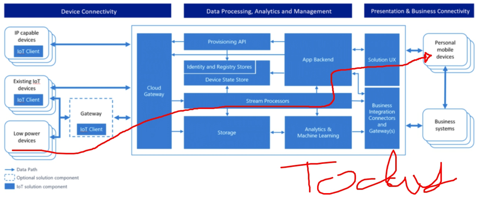
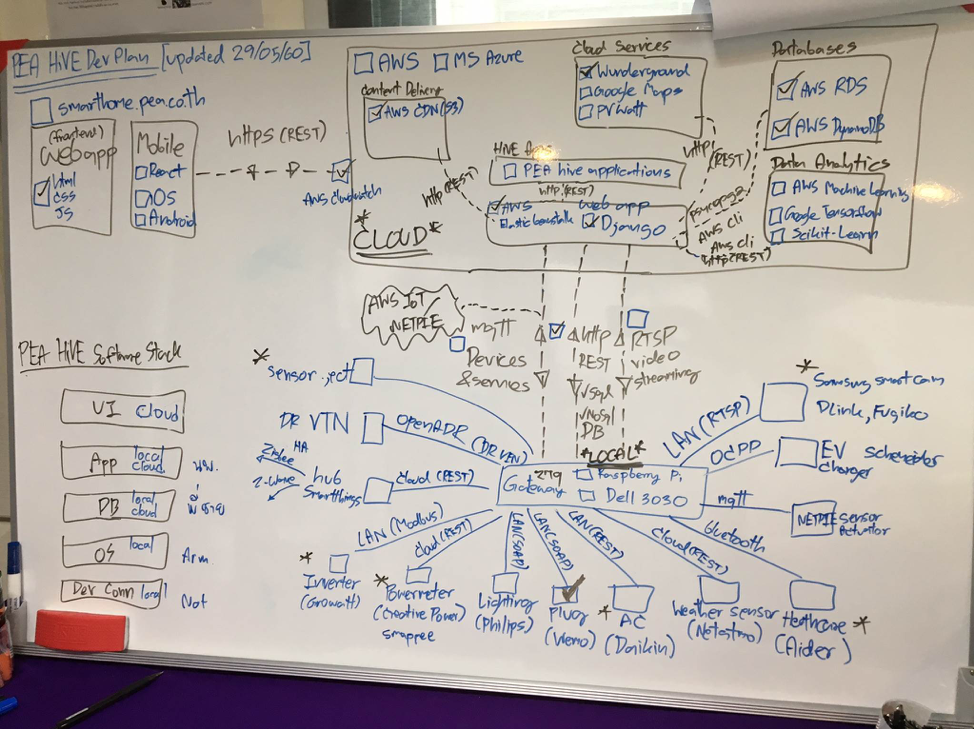
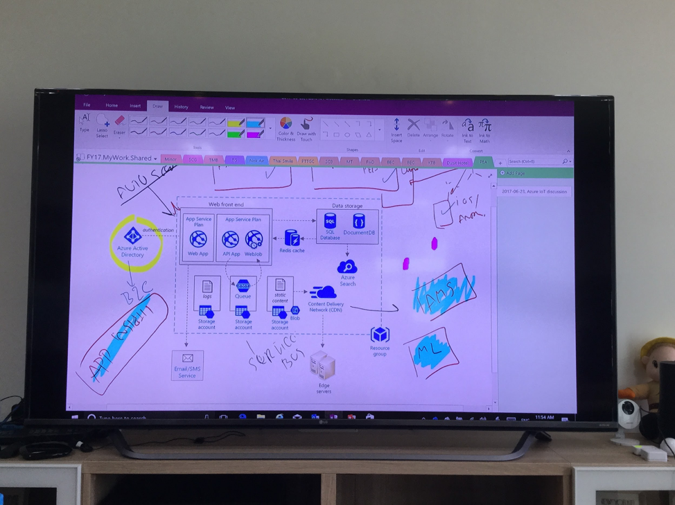

.. _pea-hive-software-architecture:

PEA HiVE Software Architecture
==========

----

PEA HiVE คือ IoT แพลตฟอร์มสำหรับระบบบริหารจัดการพลังงานภายในบ้านและอาคาร
โดยมีวัตถุประสงค์หลักในการทำให้เครื่องใช้ไฟฟ้าจากหลายๆผลิตภัณฑ์ที่มีเทคโนโลยี
ระบบสื่อสารที่หลากหลาย ยกตัวอย่างเช่น อินเวอร์เตอร์ ที่ใช้การสื่อสารผ่าน Modbus หรือ เครื่องปรับอากาศ ที่ใช้การสื่อสารผ่านระบบ Cloud ให้สามารถทำงานร่วมกันได้
มีซอฟต์แวร์ที่ช่วยให้ผู้อยู่อาศัยภายในบ้านหรือภายในอาคารได้เข้าใจและบริหารจัดการการใช้พลังงานไฟฟ้าภายในบ้านหรืออาคารได้อย่างอัตโนมัติ
สอดคล้องกับไฟฟ้าจากพลังงานแสงอาทิตย์ที่ผลิตได้
โดยมีเป้าหมายสำคัญในการจัดการการใช้พลังงานไฟฟ้าสุทธิของบ้านพักอาศัยที่ติดตั้งระบบโซลาร์รูฟท็อบให้เป็นศูนย์ (Net-Zero Energy)
ส่งผลให้เจ้าของบ้านผู้ติดตั้งระบบโซลาร์รูฟท็อบใช้ประโยชน์ระบบที่ติดตั้งได้อย่างเต็มที่และคุ้มค่ามากที่สุด

PEA HiVE ประกอบไปด้วยซอฟต์แวร์จำนวน 4 ส่วน ได้แก่

1) user interface layer

2) application layer

3) operating system layer

4) device connectivity layer

PEA HiVE เป็นแพลตฟอร์มที่เปิดให้นักพัฒนาฮาร์ดแวร์และซอฟต์แวร์ สามารถนำ source code ไปพัฒนาต่อได้
ยกตัวอย่างเช่น การพัฒนาแอพพลิเคชั่นสำหรับรองรับการเข้าร่วมโปรแกรม Demand Response สำหรับบ้านอยู่อาศัยและอาคาร
หรือการพัฒนาเซนเซอร์ใหม่ๆ ที่ใช้ระบบสื่อสาร ผ่าน MQTT โปรโตรคอล หรือการพัฒนาต่อยอด user interface ใหม่ๆ บน web
หรือ mobile application รวมไปถึงการทำอุปกรณ์ใหม่ๆเข้ามาเชื่อมต่อกับ PEA HiVE Platform ได้

----

PEA HiVE Architecture Version #2 (with Microsoft Azure Cloud services)
----------------------------------------------------------------------

